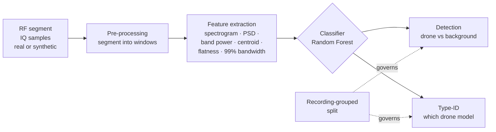

# 3. System architecture

SpectraHawk is a small Python library plus runnable example scripts. Algorithms
live in the library; each script wires them together and writes a figure.

## 3.1 The pipeline

A captured RF segment is split into fixed windows; each window is summarised into
frequency-domain features; a classifier produces either a detection decision or a
drone-model label. Crucially, the **recording-grouped split** governs how the
data is divided for training and testing, so the evaluation cannot leak (Chapter
5).

## 3.2 The library modules

| Module | Responsibility | Notes |
|---|---|---|
| `synth_rf.py` | Generate synthetic RF (narrowband bursts, frequency hopping, background) so everything runs without data | the runnable fallback |
| `data_io.py` | Load real DroneRF data and assign **recording-level groups** (BUI with the H/L band merged) | the leakage-safe loader |
| `features.py` | Turn an RF segment into a spectrogram, PSD, and a compact spectral feature vector | band power, centroid, flatness, 99% bandwidth |
| `models.py` | Classifiers (Random Forest / SVM baseline) | transparent yardstick |
| `evaluate.py` | Honest metrics & plots (ROC, Pd@FA, confusion) | shared with the EchoHawk design |

## 3.3 The demos and the figures they make

| Script | What it shows | Figure(s) |
|---|---|---|
| `examples/01_detection_demo.py` | Drone vs background detection, naive vs recording-grouped | `roc.png`, `confusion.png` |
| `examples/02_typeid_demo.py` | Drone type identification (AR vs Bebop), naive vs grouped | `typeid_confusion.png`, `spectrogram.png` |

## 3.4 Design choices worth knowing

- **Runs with no data.** The synthetic generator lets a newcomer reproduce the
  pipeline immediately; real-data scripts fall back to it gracefully when DroneRF
  is absent.
- **Grouping is a first-class concern.** The loader returns a `groups` array
  (one id per independent recording) so that every split is leakage-aware by
  construction — this is wired in from the start, not bolted on.
- **Interpretable features.** The baseline uses quantities a radio engineer would
  recognise, keeping the result explainable.
- **Honest by default.** Every result is reported both ways — the inflated
  *naive* split and the honest *grouped* split — so the size of any leakage is
  always visible.

➡ Next: [Detection & type identification](04_detection_and_typeid.md).
